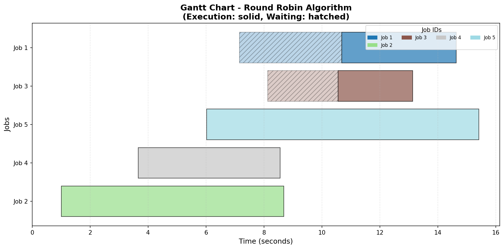
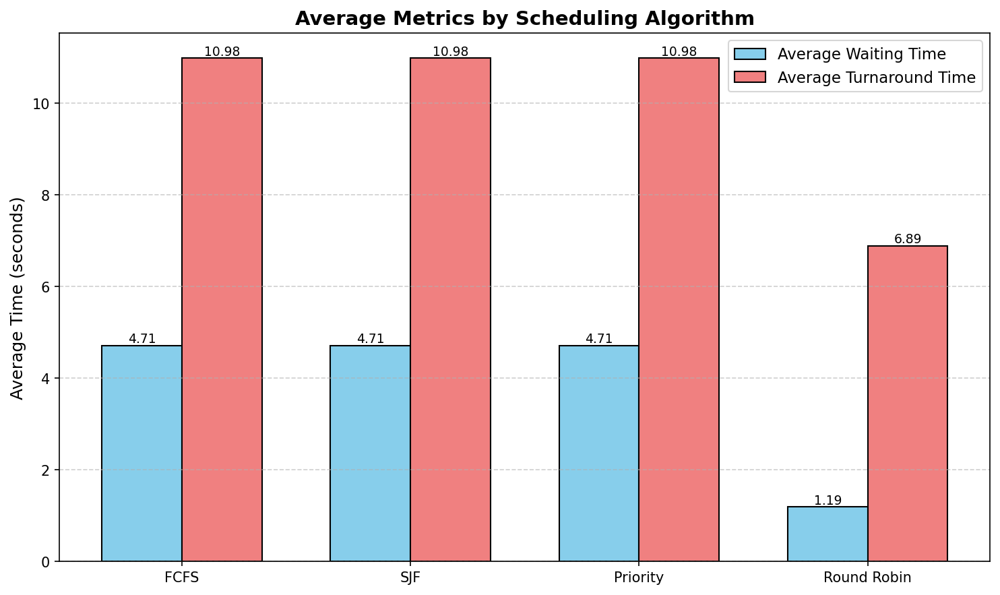
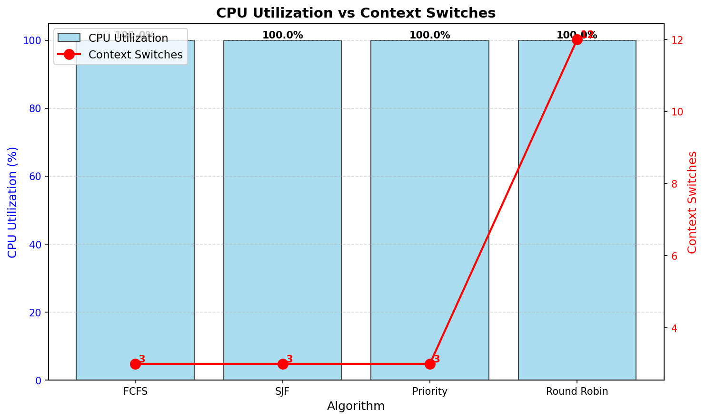

# Chronos - Multithreaded CPU Scheduler Simulator

Developed as part of my Operating Systems class (CSE 4300) at UConn.

A multithreaded CPU scheduling simulator written in C++17 that simulates different scheduling algorithms using multithreading to represent multiple CPU cores. It supports FCFS, SJF, Priority, and Round Robin scheduling algorithms with metrics collection and visualization.

## Features

- **Multiple Scheduling Algorithms**: First-Come-First-Served (FCFS), Shortest Job First (SJF), Priority-based, and Round Robin (RR)
- **Multithreaded Simulation**: Each CPU core is represented by a worker thread with independent time tracking
- **Comprehensive Metrics**: Tracks waiting time, turnaround time, CPU utilization (≤100%), and context switches
- **CSV Export**: Exports per-job metrics and aggregate summaries for analysis
- **Visualization**: Python/Matplotlib scripts generate Gantt charts and comparison graphs
- **Compare-All Mode**: Automatically runs all 4 algorithms on the same job set for performance comparison

## Building

### Prerequisites

- C++17 compatible compiler (GCC 7+, Clang 5+, or MSVC 2017+)
- Python 3.6+ with matplotlib and numpy (for visualizations)

### Build Instructions

#### Manual Compilation

```bash
g++ -std=c++17 -Iinclude \
    src/*.cpp main.cpp \
    -o schedsim \
    -pthread
```

On macOS with Clang:
```bash
clang++ -std=c++17 -Iinclude \
        src/*.cpp main.cpp \
        -o schedsim \
        -pthread
```

## Usage

### Command-Line Options

- `--algo, -a <ALGO>`: Scheduling algorithm (FCFS, SJF, Priority, RR)
- `--cores, -c <NUM>`: Number of CPU cores (positive integer)
- `--jobs, -j <NUM>`: Number of jobs to generate (positive integer)
- `--quantum, -q <NUM>`: Time quantum for Round Robin (positive integer, **required for single RR runs**)
- `--compare-all`: Run all 4 algorithms on the same job set and compare results
- `--help, -h`: Show help message

### Single Algorithm Mode

Run one algorithm with detailed per-job metrics:

```bash
# FCFS example
./schedsim --cores 2 --algo FCFS --jobs 5

# SJF example
./schedsim --cores 2 --algo SJF --jobs 5

# Priority example
./schedsim --cores 2 --algo PRIORITY --jobs 5

# Round Robin example (quantum required)
./schedsim --cores 2 --algo RR --quantum 2 --jobs 5
```

**Outputs generated**:
- `output/metrics.csv` (per-job data)
- `output/summary.csv` (aggregate metrics)
- All 3 visualization charts available

### Compare-All Mode

Run all algorithms on the same job set for comparison:

```bash
./schedsim --cores 2 --jobs 10 --compare-all
```

**Optional**: Specify quantum for Round Robin (default is 2):
```bash
./schedsim --cores 2 --jobs 10 --compare-all --quantum 3
```

**Outputs generated**:
- No `metrics.csv` (intentionally omitted to avoid duplication)
- `output/summary.csv` (aggregate comparison for all 4 algorithms)
- Only `avg_metrics.png` and `utilization.png` available
- No Gantt chart (requires per-job metrics)

**Rationale**: In compare-all mode, the same job set runs 4 times (once per algorithm). Per-job metrics would create a massive CSV with duplicate job IDs. The mode is designed for **aggregate comparison**, not detailed timeline analysis.

## Visualization

Generate visualizations from the CSV files:

```bash
python3 tools/visualize.py
```

The script automatically handles missing files gracefully and generates available charts.

### Visualization Requirements

Install Python dependencies:

```bash
pip install matplotlib numpy
```

### Generated Charts

The visualization script generates charts based on available data:

#### 1. Gantt Chart (Single Algorithm Mode Only)

Shows job execution timeline with color-coded jobs and waiting periods.



**Features**:
- X-axis: Time (seconds)
- Y-axis: Job IDs
- Solid bars: Execution periods
- Hatched bars: Waiting periods
- Color-coded by job ID

#### 2. Average Metrics Comparison

Compares average waiting and turnaround times across algorithms.



**Features**:
- X-axis: Algorithms (FCFS, SJF, Priority, RR)
- Y-axis: Average Time (seconds)
- Blue bars: Average Waiting Time
- Coral bars: Average Turnaround Time
- Value labels on bars

#### 3. CPU Utilization vs Context Switches

Dual-axis chart showing efficiency vs overhead.



**Features**:
- X-axis: Algorithms
- Left Y-axis: CPU Utilization (%) - blue bars
- Right Y-axis: Context Switches - red line
- Value labels for both metrics
